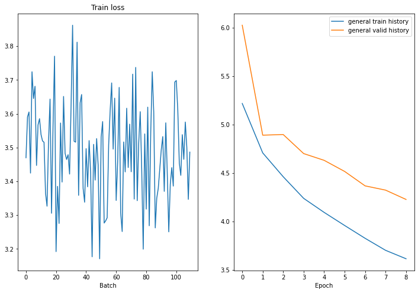
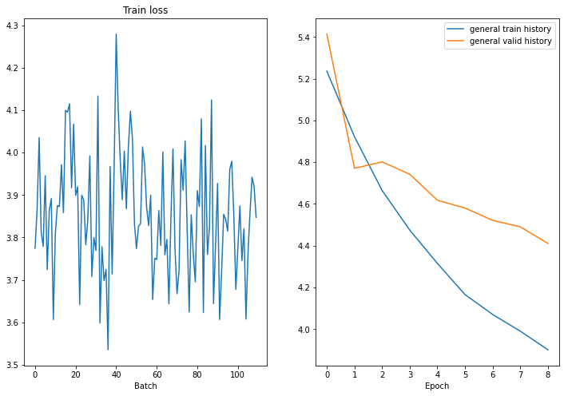
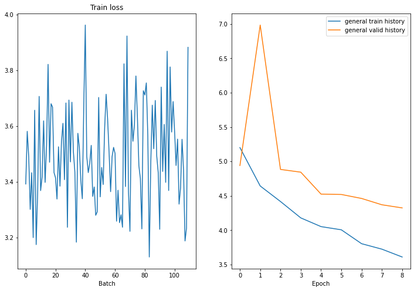

# HW2 - NMT Nishit

Using spacy dataset.

## Base Model

### N_layers = 2


```sh
Epoch: 10 | Time: 0m 29s
Train Loss: 3.487 | Train PPL: 32.698
Val. Loss: 4.144 | Cal. PPL: 63.074
```

##### Translations:

```sh
Original: a man with a black vest holding a model airplane
Generated: a man wearing a black shirt and black pants .

Original: several construction workers with orange safety vests are digging into the ground .
Generated: five men in white vests are standing in a of a .
```

#### BLEU Score: 8.86837907210041

### N_layers = 4



```sh
Epoch: 10 | Time: 0m 40s
	Train Loss: 3.860 | Train PPL:  47.480
	 Val. Loss: 4.294 |  Val. PPL:  73.295
```

#### Translations:

```sh
Original: a man with a black vest holding a model airplane
Generated: a man in a blue shirt is a .

Original: several construction workers with orange safety vests are digging into the ground .
Generated: people are in a and and a a a .
```

#### BLEU Score: 5.459281682529812


## Adding Attention



```sh
Epoch: 10 | Time: 0m 25s
	Train Loss: 3.500 | Train PPL:  33.103
	 Val. Loss: 4.232 |  Val. PPL:  68.830
```

#### Translation:

Original: a man with a black vest holding a model airplane
Generated: a man in a black shirt is holding a book .

Original: several construction workers with orange safety vests are digging into the ground .
Generated: three men in blue shirts and a on a . .


#### BLEU Score: 7.887873612813751
